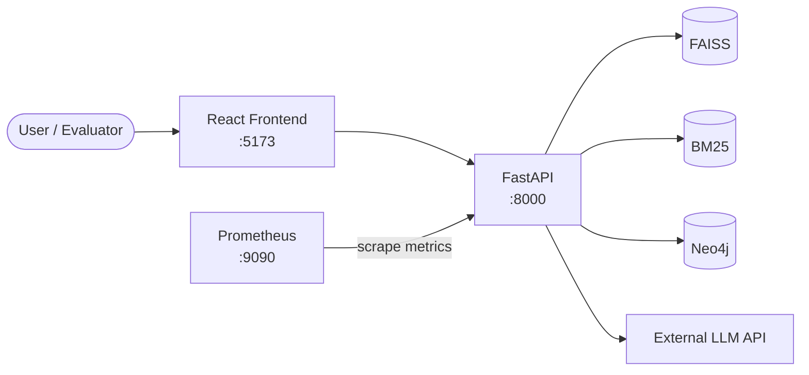
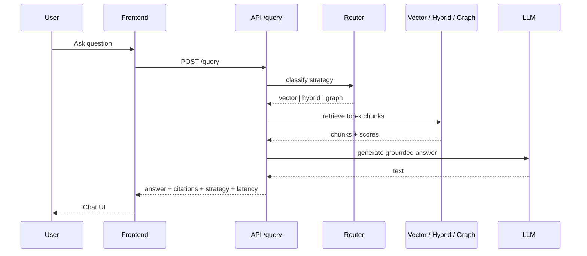
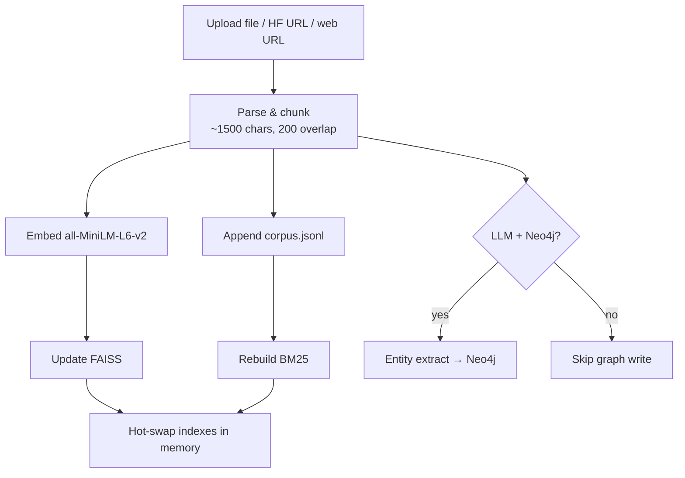
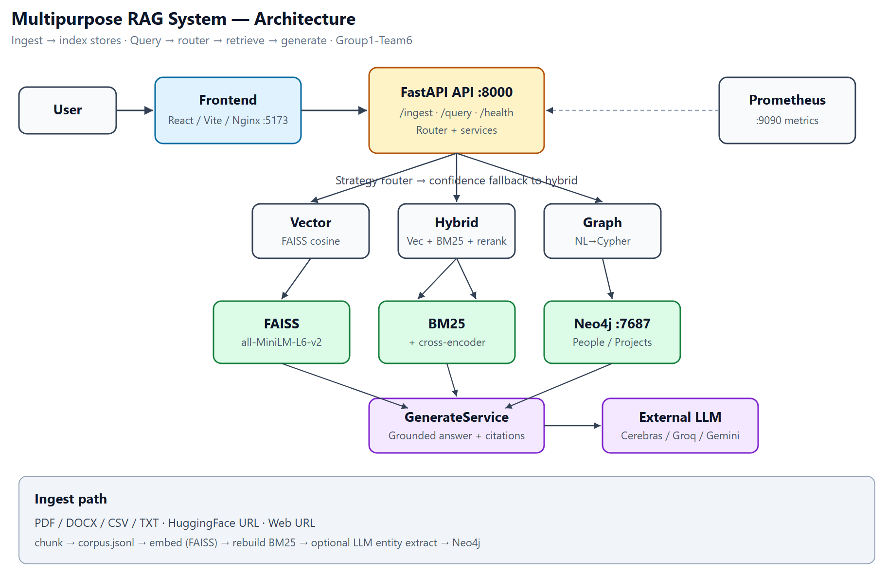

# Architecture — Multipurpose RAG System

Visual diagram: **[architecture.png](architecture.png)** · **[architecture.svg](architecture.svg)** (also embedded below).

---

## System context

---

## Query path

---

## Ingest path

---

## Component map

| Component | Responsibility |
|-----------|----------------|
| `frontend/` | Home, Upload, Chat UI |
| `app/routers/ingest.py` | File/URL ingest + jobs |
| `app/routers/query.py` | Query orchestration, service wiring |
| `app/routers/health.py` | Liveness |
| `app/services/router_service.py` | Strategy selection + confidence fallback |
| `app/services/vector_service.py` | FAISS search |
| `app/services/hybrid_service.py` | Vector + BM25 merge + rerank |
| `app/services/graph_service.py` | NL→Cypher + Neo4j |
| `app/services/generate_service.py` | Grounded generation |
| `app/services/ingest_service.py` | Parse, chunk, index, optional graph extract |
| `data/seed/` + `data/index/` | Durable corpus and indexes |
| `monitoring/prometheus.yml` | Scrape config |

Deep narrative: [../WORKFLOW.md](../WORKFLOW.md). Ops: [../RUNBOOK.md](../RUNBOOK.md).

---

## Diagram

